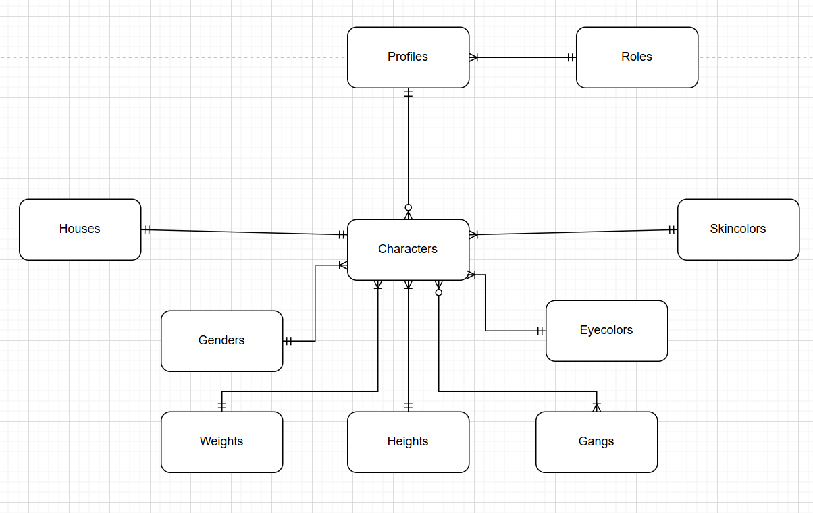
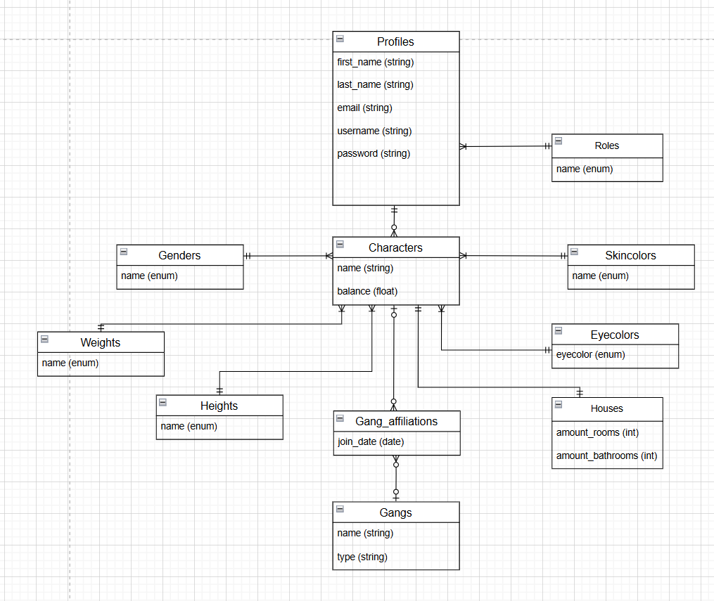
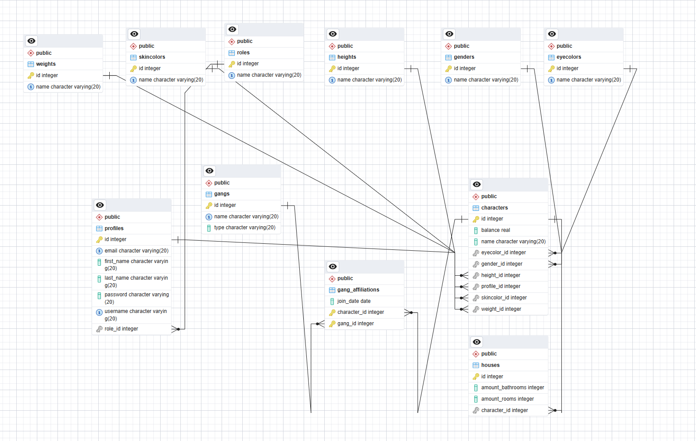

---
header-includes:
  - \usepackage{fancyhdr}
  - \pagestyle{fancy}
  - \fancyhf{}
  - \fancyfoot[R]{\thepage}
  - \renewcommand{\headrulewidth}{0pt}
  - \renewcommand{\footrulewidth}{0pt}
---

# RPG Game Database Design
### Final Version

**Prepared by Group 1**

Ahmad Abdel Razak Hussein Alkaseb  
Benjamin Sebastian Barrales Hernandez  
Jeppe Ronning Koch  
Laith Abdel Razak Hussein Alkaseb  
Sadek Alsukafi

---

| **Course** | Database |
|---|---|
| **Project** | RPG Game by Bajls |
| **Date of delivery** | *(To be filled in)* |
| **List of figures** | *(To be filled in)* |
| **List of appendices** | *(To be filled in)* |

## 1. Introduction

Our goal is to design and develop a next-generation RPG game inspired by
the creative freedom and social interaction found in platforms like
Roblox. The game allows players to explore an interactive world,
customize their characters in detail, and engage in dynamic gameplay
experiences.

At its core, the game revolves around a customizable character that can
move freely in a large open world. Players experience the game through
their character, whose appearance, identity, and status are visible to
others in real time. As in Roblox-inspired games, visual identity and
personalization are central to the player experience.

The first development phase focuses on character customization and
player identity. Players create a personal profile and design one or
more unique characters with specific physical traits and attributes.
These traits define how the character looks and can later support social
interactions and additional gameplay mechanics.

The world is structured around exploration, housing, and social systems
such as gangs. Every character is stored in a structured database that
maintains logical relationships between profiles, characters, roles, and
properties. The system enforces clear rules for ownership, identity, and
mandatory attributes.

The player experience includes:

-   Creating a personal profile
-   Customizing characters with physical traits
-   Exploring the map
-   Owning a house
-   Optionally joining a gang
-   Interacting with other players

The game architecture must support both regular players and
administrators who manage the system.

### 1.2. Explanation of choices for databases and programming languages, and other tools

The project uses **PostgreSQL** as the database system because the
domain is strongly relational and depends on strict integrity rules.
PostgreSQL gives stable transactional behavior, strong foreign-key
enforcement, and good support for normalized schemas with bridge tables
such as `gang_affiliations`.

The application is implemented in **Java 17** with **Maven** as the
build tool. Java was selected because the project team works with an
object-oriented domain model, and Java integrates directly with JPA
annotations for entity mapping. Maven provides predictable dependency
management and reproducible builds across environments.

For persistence, the project uses **Hibernate (JPA)**. This allows the
team to model business entities (`Profile`, `GameCharacter`, `House`,
`Gang`, lookup tables) directly in code and keep the SQL schema aligned
through mapping metadata. Hibernate is configured for PostgreSQL and
supports both local development and deployment profiles through
environment variables.

Additional tools include:

-   **Lombok** for reducing boilerplate code in entities (getters,
    setters, constructors, builders).
-   **Testcontainers** for disposable PostgreSQL instances during tests,
    which improves repeatability and reduces local setup variance.
-   **pgAdmin** for visual inspection of the physical schema and foreign
    key network.

------------------------------------------------------------------------

## 2. Requirements

This section defines the functional requirements for our RPG game
inspired by Roblox. The purpose is to clearly define persons, profiles,
characters, and their relationships in the system. The system must
enforce strict rules to ensure data integrity, logical consistency, and
reliable gameplay functionality.

### 2.1. Intro to relational databases

A relational database organizes information in tables connected by
keys. This model is suitable for the RPG domain because core business
rules are relationship-based: one profile can own many characters, each
character must belong to exactly one profile, and gang membership is
many-to-many through a bridge table.

Relational systems are also appropriate when consistency is more
important than schema flexibility. In this project, invalid states such
as characters without profiles, houses without owners, or duplicate
membership records must be prevented in the database itself. PostgreSQL
handles this through primary keys, foreign keys, unique constraints, and
transaction guarantees.

### 2.2. Database design

The database design follows a layered progression from requirements to
implementation:

-   First, domain requirements define mandatory entities and
    cardinalities.
-   Next, the conceptual and logical models translate those rules into
    normalized relations.
-   Finally, the physical model implements data types, keys, and
    constraints in PostgreSQL/Hibernate.

This process ensures that design decisions are traceable from business
rules to concrete table definitions and mapping annotations.

### Profile and Role Requirements

#### Person and Profile

-   A person can have exactly one profile in the system.
-   The profile represents the player's digital identity.
-   A profile must be uniquely identifiable (for example by `profile_id`
    or `username`).
-   A person is not allowed to create multiple profiles.

This ensures that each real-world player is connected to one controlled
game identity.

#### Role System

-   A profile must have exactly one role.
-   The role can be either `User` or `Admin`.
-   A profile cannot have multiple roles at the same time.
-   `Admin` accounts have extended permissions compared to `User`
    accounts, such as management and moderation functionality.

This establishes role-based access control in the game.

### Character Requirements

#### Profile to Character Relationship

-   A profile can have one or more characters.
-   A character must belong to exactly one profile.
-   A character cannot exist without being linked to a profile.

This creates a one-to-many relationship between `Profile` and
`Character`.

#### Character Attributes

Each character must have exactly one of each required attribute:

-   One gender
-   One weight
-   One height
-   One eye color
-   One skin color

All attributes are mandatory and cannot be empty. A character cannot
have multiple values for any of these attributes. The system must
validate that all required attributes are present before a character can
be created.

### Housing Requirement

-   A character must have exactly one house.
-   A character cannot exist without an assigned house.
-   A house belongs to exactly one character.
-   A house cannot be shared by multiple characters.

This creates a mandatory one-to-one relationship between `Character` and
`House`. The system must prevent characters without houses and houses
without assigned characters.

### Gang Membership Requirement

-   Gang membership is optional.
-   A character can belong to zero or more gangs.
-   A gang can have zero or more characters.

This establishes an optional many-to-many relationship between
`Character` and `Gang`.

### Data Integrity Rules

The system must enforce the following constraints:

-   Every person has at most one profile.
-   Every profile has exactly one role.
-   Every character belongs to exactly one profile.
-   Every character has all required physical attributes.
-   Every character has exactly one house.
-   A character may belong to zero or more gangs.

The system must prevent invalid states such as orphan characters,
missing houses, missing roles, or duplicate role assignments.

### Relationship Summary

-   `Person` to `Profile`: One-to-One
-   `Profile` to `Role`: One-to-One
-   `Profile` to `Character`: One-to-Many
-   `Character` to `House`: One-to-One (Mandatory)
-   `Character` to `Gang`: Optional Many-to-Many
-   `Character` to Attributes: Exactly one value per required attribute

### Conclusion

These requirements define the structural foundation of the RPG system.
They ensure clear identity management, controlled permissions, complete
character definitions, and mandatory housing ownership. This
specification forms the basis for conceptual, logical, and physical
database modeling.

------------------------------------------------------------------------

### 2.2.1. Entity/Relationship Model (Conceptual -> Logical -> Physical model)

This section presents the entity/relationship progression from
conceptual understanding to logical structure, and prepares the
transition to the physical implementation in Section 2.3.

### Conceptual Model

The conceptual model describes the business domain without technical
implementation details such as data types, indexes, or SQL syntax. Its
purpose is to show what information the system must manage and how core
concepts are related from a game and business perspective. In this
project, `Characters` is the central concept because most game actions,
ownership rules, and social interactions are represented through
character entities.

### Conceptual Diagram

The model includes the following core entities:

-   **Profiles**: the persistent player identity used for login and
    account-level ownership.
-   **Roles**: access-level definitions (`User` and `Admin`) connected
    to profile permissions.
-   **Characters**: playable identities controlled by profiles inside
    the game world.
-   **Houses**: character-owned properties used to represent private
    assets and ownership constraints.
-   **Gangs**: social groups that support optional membership and
    multi-character affiliation.
-   **Genders, Weights, Heights, Eyecolors, Skincolors**: controlled
    attribute domains used to define mandatory character appearance
    traits.

### Key Relationships in the Diagram

-   `Profiles` to `Roles`: many-to-one.
    Each profile has exactly one role, while one role can be assigned to
    many profiles.
-   `Profiles` to `Characters`: one-to-many.
    A profile can own multiple characters, and each character belongs to
    one profile.
-   `Characters` to `Houses`: one-to-one (mandatory).
    Each character must be linked to one house, and each house belongs
    to one character.
-   `Characters` to appearance tables (`Genders`, `Weights`, `Heights`,
    `Eyecolors`, `Skincolors`): many-to-one for each attribute.
    Each character has exactly one value per attribute, and many
    characters can share the same attribute value.
-   `Characters` to `Gangs`: optional many-to-many.
    A character may join zero or more gangs, and each gang may contain
    multiple characters.

### Cardinality and Modality

In this project, relationship rules are described using both
**cardinality** and **modality**:

-   **Cardinality** defines the maximum number of related rows (for
    example one-to-one, one-to-many, many-to-many).
-   **Modality** defines whether participation is mandatory or optional
    (minimum 1 or minimum 0).

Applied to our model:

-   `Profile` -> `Character`: cardinality is one-to-many, modality is
    mandatory on `Character` side (every character must have one
    profile) and optional on profile side (a profile can exist with zero
    characters).
-   `Character` -> `House`: cardinality is one-to-one, modality is
    mandatory on character side in our JPA mapping because
    `characters.house_id` is `NOT NULL` and `UNIQUE`. On house side, a
    house can exist without being referenced by a character unless extra
    business rules are added.
-   `Character` <-> `Gang`: cardinality is many-to-many via
    `gang_affiliations`, modality is optional on both sides (0..N).
-   `Character` -> attribute lookup tables (`Gender`, `Weight`,
    `Height`, `EyeColor`, `SkinColor`): cardinality is many-to-one,
    modality is mandatory on character side because each FK is required.

The conceptual model also defines participation rules. Participation is
mandatory for `Character` to `Profile`, `Character` to `House`, and
`Character` to each appearance category because these are required for
valid gameplay state. Participation is optional for gang membership
because not all players must engage in group-based social mechanics.

From a domain perspective, this model prevents ambiguous ownership. A
profile owns characters, characters own houses, and social membership is
kept independent through gangs. This separation is important because
each area has different lifecycle rules: deleting or deactivating a
profile affects owned characters, while gang membership can be added or
removed without changing character identity.

The conceptual view therefore acts as the foundation for the next
models. It communicates business meaning to both technical and
non-technical stakeholders, verifies that rules are complete before
implementation, and reduces redesign risk later in the project.

### Logical Model

The logical model translates the conceptual design into a normalized
relational structure. At this level, entities are expressed as tables,
relationships are expressed using primary and foreign keys, and business
rules are transformed into enforceable structural constraints. The
logical model remains DBMS-independent in principle, but it is precise
enough to be implemented consistently.

### Logical Diagram

### Main Tables

-   **Profiles** (`profile_id` PK, first_name, last_name, email,
    username, password, `role_id` FK)
-   **Roles** (`role_id` PK, name)
-   **Characters** (`character_id` PK, name, balance, `profile_id` FK,
    `gender_id` FK, `weight_id` FK, `height_id` FK, `eyecolor_id` FK,
    `skincolor_id` FK)
-   **Houses** (`house_id` PK, amount_rooms, amount_bathrooms,
    inverse 1:1 link)
-   **Gangs** (`gang_id` PK, name, type)
-   **Gang_Affiliations** (`character_id` FK, `gang_id` FK, join_date,
    composite PK)
-   **Genders, Weights, Heights, Eyecolors, Skincolors**
    (`id` PK, `name`)

The table layout intentionally separates high-change data from
low-change reference data. `characters` is transaction-heavy and
contains gameplay-relevant state, while lookup tables hold stable
classification values. This design reduces redundancy and makes updates
predictable. For example, changing a lookup label does not require
editing every character row.

### Logical Relationship Rules

-   One `Profile` belongs to one `Role`; one `Role` can be used by many
    profiles.
-   One `Profile` can own many `Characters`.
-   Each `Character` must reference exactly one value in each attribute
    lookup table.
-   `Character` and `House` are modeled as a one-to-one relation via a
    unique foreign key (`characters.house_id`).
-   `Character` and `Gang` are modeled through the bridge table
    `Gang_Affiliations` (many-to-many).

In addition to these cardinalities, the logical model defines key
strategy and uniqueness boundaries:

-   Surrogate keys (`id`) are used for stable identity across all main
    tables.
-   `username` should be unique at profile level to guarantee a single
    login identity per player.
-   `characters.house_id` is unique to enforce one house per character.
-   `gang_affiliations` uses a composite key (`character_id`, `gang_id`)
    to prevent duplicate membership records.

This structure supports both correctness and scalability. As the number
of players grows, relationships remain clear and query paths remain
deterministic. Typical queries, such as "all characters for profile X"
or "all gangs for character Y," map directly to key-based joins.
Logical clarity at this stage is critical because it minimizes ambiguity
before physical optimization in PostgreSQL.

------------------------------------------------------------------------

### 2.2.2. Normalization process

Normalization is applied to ensure that data is stored once, updated in
one place, and queried without contradictions. The goal is to eliminate
redundancy and avoid insertion, update, and deletion anomalies that
would otherwise appear in gameplay data.

### First Normal Form (1NF)

1NF requires atomic attributes and no repeating groups in a single
column. In this schema, all tables satisfy 1NF because each column holds
one value per row. For example, a character does not store multiple eye
colors or multiple gang IDs in one field. Multi-valued relationships are
modeled through separate tables (especially `gang_affiliations`).

### Second Normal Form (2NF)

2NF requires that non-key attributes depend on the full primary key, not
part of it. This is especially relevant in tables with composite keys.
`gang_affiliations` satisfies 2NF because `join_date` depends on the
specific combination of `character_id` and `gang_id` rather than only
one of them. No partial dependency is present.

### Third Normal Form (3NF)

3NF removes transitive dependencies where non-key attributes depend on
other non-key attributes. The schema satisfies this by separating roles,
appearance categories, and gangs into dedicated tables referenced by
foreign keys. For example, role names are not duplicated in `profiles`,
and appearance labels are not duplicated in `characters`.

The resulting 3NF design improves consistency and maintainability:

-   Changes are localized to one table.
-   Duplicate text values are minimized.
-   Integrity constraints become easier to enforce.
-   Query semantics remain stable as data volume grows.

The final logical schema therefore satisfies **3NF** and provides a
reliable base for physical implementation.

------------------------------------------------------------------------

## 2.3. Physical data model

The physical model is the concrete PostgreSQL implementation of the
logical schema. At this stage, abstract relations are converted into
actual database objects with column types, constraints, and execution
characteristics. The implementation shown in pgAdmin reflects the final
table structure and foreign-key network used by the project.

### Physical Diagram

### Implementation Details

-   Primary keys are implemented as integer identifiers (`id`).
-   Foreign keys are created between dependent tables to enforce
    referential integrity.
-   The `characters.house_id` column is unique, enforcing one house per
    character.
-   The `gang_affiliations` table stores many-to-many links between
    characters and gangs, including `join_date`.
-   Lookup tables (`genders`, `weights`, `heights`, `eyecolors`,
    `skincolors`, `roles`) reduce redundancy and centralize valid
    values.

The PostgreSQL schema is designed to enforce business rules at database
level, not only in application code. Mandatory fields are protected with
`NOT NULL`, key relationships are protected with foreign keys, and
entity identity is protected with primary-key constraints. This reduces
the risk of inconsistent data even if multiple services or scripts write
to the same database.

For relationship-heavy queries, indexing strategy is important. Primary
keys are indexed automatically, and foreign-key columns should be
indexed to improve join performance, especially for frequent operations
such as loading profile characters, character attributes, or gang
memberships. As data volume increases, this prevents full-table scans
for common gameplay queries.

Operationally, the physical design also supports maintainability:

-   Clear naming conventions for tables and columns.
-   Dedicated bridge table for many-to-many associations.
-   Stable lookup tables for controlled enumerations.
-   Predictable join paths for reporting and administration tools.

### Cardinality and Modality in the Physical Model

At the physical level, cardinality and modality are enforced through
foreign keys, uniqueness, and nullability:

-   `profiles.role_id` is `NOT NULL` and references `roles.id`, so each
    profile must have exactly one role (mandatory many-to-one).
-   `characters.profile_id` is `NOT NULL`, so each character must belong
    to one profile, while a profile can still have zero or many
    characters.
-   `characters.house_id` is both `NOT NULL` and `UNIQUE`, enforcing one
    mandatory house per character and preventing multiple characters from
    referencing the same house.
-   Attribute foreign keys in `characters` (`gender_id`, `weight_id`,
    `height_id`, `eyecolor_id`, `skincolor_id`) are mandatory, which
    enforces complete character definitions.
-   `gang_affiliations` implements optional many-to-many membership:
    both sides can have zero or many links, while each link row must
    reference exactly one character and one gang.

### 2.3.1. Data types

-   `INTEGER` for primary and foreign keys
-   `VARCHAR(20)` for names and short text values
-   `REAL` for character balance
-   `DATE` for `join_date` in `gang_affiliations`
-   `NOT NULL` on mandatory columns

These choices balance simplicity and correctness. Integer keys are fast
for joins, short varchar fields are sufficient for constrained labels,
and date storage supports timeline analysis of gang membership. If
future requirements demand larger values or stricter validation, the
model can be extended with wider text constraints, check constraints,
and additional indexes without breaking the current structure.

### 2.3.2. Primary and foreign keys

Primary keys are implemented as surrogate integer IDs with
auto-generation (`GenerationType.IDENTITY`) in all main tables. This
gives stable identifiers independent of mutable business attributes.

Foreign keys encode the core relationships:

-   `characters.profile_id` -> `profiles.id`
-   `characters.gender_id` -> `genders.id`
-   `characters.skincolor_id` -> `skincolors.id`
-   `characters.eyecolor_id` -> `eyecolors.id`
-   `characters.height_id` -> `heights.id`
-   `characters.weight_id` -> `weights.id`
-   `profiles.role_id` -> `roles.id`
-   `characters.house_id` -> `houses.id` (unique)
-   `gang_affiliations.character_id` -> `characters.id`
-   `gang_affiliations.gang_id` -> `gangs.id`

The many-to-many relation between characters and gangs is implemented
with `gang_affiliations`, where the composite key
(`character_id`, `gang_id`) prevents duplicate memberships for the same
pair.

### 2.3.4. Constraints and referential integrity

The schema enforces integrity through a combination of column
constraints and relationship constraints:

-   `NOT NULL` is used on mandatory attributes (for example profile
    names, credentials, role references, character references, and
    `join_date`).
-   `UNIQUE` constraints prevent duplicates on identity-like values:
    `profiles.email`, `profiles.username`, `gangs.name`, and
    `characters.house_id`.
-   Foreign-key constraints ensure references remain valid across table
    boundaries. Examples include `fk_profiles_role`,
    `fk_characters_profile`, `fk_characters_house`, `fk_gang_aff_char`,
    and `fk_gang_aff_gang`.

In JPA/Hibernate mappings, required references are also marked with
`optional = false`, which aligns object-level validation with database
rules. Together, these constraints protect against orphan rows,
inconsistent ownership, and duplicate relationship records.
