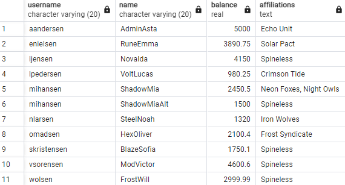
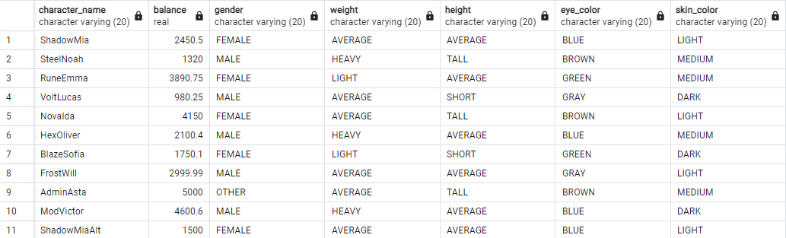

---
header-includes:
  - '\usepackage{fancyhdr}'
  - '\usepackage{tcolorbox}'
  - '\usepackage{fvextra}'
  - '\usepackage{float}'
  - '\tcbuselibrary{breakable}'
  - '\AtBeginDocument{\fvset{breaklines=true,breakanywhere=true}}'
  - '\pagestyle{fancy}'
  - '\fancyhf{}'
  - '\fancyhead[L]{\today}'
  - '\fancyhead[C]{Database course}'
  - '\fancyhead[R]{Bajls}'
  - '\fancyfoot[R]{\thepage}'
  - '\renewcommand{\headrulewidth}{0pt}'
  - '\renewcommand{\footrulewidth}{0pt}'
  - '\renewenvironment{Shaded}{\begin{tcolorbox}[breakable,colback=white,colframe=black,boxrule=0.4pt,arc=1.5pt,left=4pt,right=4pt,top=4pt,bottom=4pt]}{\end{tcolorbox}}'
  - '\setcounter{tocdepth}{3}'
---
\begin{center}
\textbf{RPG Game Database Design}

Version 1

Ahmad Abdel Razak Hussein Alkaseb\\
Benjamin Sebastian Barrales Hernandez\\
Jeppe Ronning Koch\\
Laith Abdel Razak Hussein Alkaseb\\
Sadek Alsukafi
\end{center}

---


| **Course**                                  | Database            |
| ------------------------------------------- | ------------------- |
| **Project**                                 | RPG Game by Bajls   |
| **Date of delivery**                        | 8/3/2026 |
| **List of figures**                         | 9 |
| **List of appendices**                      | 17 |
| **Number of characters (including spaces)** | 48909 |

\vspace{0.5cm}
\begin{center}
\begin{tabular}{ccc}
\includegraphics[width=0.30\textwidth,height=0.17\textheight,keepaspectratio]{images/frontpage/Document3.png} &
\includegraphics[width=0.30\textwidth,height=0.17\textheight,keepaspectratio]{images/frontpage/Graph-Database.png} &
\includegraphics[width=0.30\textwidth,height=0.17\textheight,keepaspectratio]{images/frontpage/what-is-a-relational-database.jpg}
\end{tabular}
\end{center}

\thispagestyle{empty}

\newpage

\tableofcontents

\newpage

# 1. Introduction

Our goal is to design and develop a next-generation RPG game inspired by
the creative freedom and social interaction found in platforms like
Roblox. The game allows players to explore an interactive world,
customize their characters in detail, and engage in dynamic gameplay
experiences.

At its core, the game revolves around a customizable character that can
move freely in a large open world. Players experience the game through
their character, whose appearance, identity, and status are visible to
others in real time. As in Roblox-inspired games, visual identity and
personalization are central to the player experience.

The first development phase focuses on character customization and
player identity. Players create a personal profile and design one or
more unique characters with specific physical traits and attributes.
These traits define how the character looks and can later support social
interactions and additional gameplay mechanics.

The world is structured around exploration, housing, and social systems
such as gangs. Every character is stored in a structured database that
maintains logical relationships between profiles, characters, roles, and
properties. The system enforces clear rules for ownership, identity, and
mandatory attributes.

The player experience includes:

- Creating a personal profile
- Customizing characters with physical traits
- Exploring the map
- Owning a house
- Optionally joining a gang
- Interacting with other players

The game architecture must support both regular players and
administrators who manage the system.

\newpage

## 1.1. System overview and cloud architecture

This project is organized as a Java application with a PostgreSQL
database. The same logical architecture is used in cloud deployment and
in local development, while runtime setup differs by environment.

### Architecture diagram (cloud deployment)

```text
[Client / Browser / API Consumer]
                |
                v
       [Java Application Service]
         (REST + business logic)
                |
                v
         [PostgreSQL Database]
                |
                v
     [Persistent Cloud Volume/Storage]
```

In cloud environments, the application service and database run as
separate managed workloads. The database persists data on dedicated
storage, while the application scales independently.

### Local development deployment (`docker-compose`)

The local setup uses `docker-compose.yml` in the project root to start
application and database services in one command.

```text
docker-compose.yml
    |
    +-- service: app (Java 17 + Maven/Hibernate)
    |       |
    |       +-- depends_on: db
    |
    +-- service: db (PostgreSQL)
            |
            +-- volume: local persistent data
```

Typical local startup command:

```bash
docker compose up -d
```

\newpage

## 1.2. Explanation of choices for databases and programming languages, and other tools

The project uses **PostgreSQL**[^postgres] as the database system because the
domain is strongly relational and depends on strict integrity rules.
PostgreSQL gives stable transactional behavior, strong foreign-key
enforcement, and good support for normalized schemas with junction tables
such as `gang_affiliations`.

The application is implemented in **Java 17**[^java17] with **Maven**[^maven] as the
build tool. Java was selected because the project team works with an
object-oriented domain model, and Java integrates directly with JPA
annotations for entity mapping. Maven provides predictable dependency
management and reproducible builds across environments.

For persistence, the project uses **Hibernate (JPA)**[^hibernate]. This allows the
team to model business entities (`Profile`, `GameCharacter`, `House`,
`Gang`, `Role`, `Gender`, `Weight`, `Height`, `EyeColor`, `SkinColor`)
directly in code and keep the SQL schema aligned
through mapping metadata. Hibernate is configured for PostgreSQL and
supports both local development and deployment profiles through
environment variables.

Additional tools include:

- **Lombok** for reducing boilerplate code in entities (getters,
  setters, constructors, builders).
- **Testcontainers** for disposable PostgreSQL instances during tests,
  which improves repeatability and reduces local setup variance.
- **pgAdmin** for visual inspection of the physical schema and foreign
  key network.

The next chapter turns these technology choices into concrete database
rules and schema decisions.

---

\newpage

# 2. Relational database

This section defines the functional requirements for our RPG game
inspired by Roblox. The purpose is to clearly define persons, profiles,
characters, and their relationships in the system. The system must
enforce strict rules to ensure data integrity, logical consistency, and
reliable gameplay functionality.

To keep a clear thread through the chapter, we move in this order:
requirements -> conceptual/logical design -> normalization -> physical
implementation -> stored database objects -> realistic seed data ->
access control.

## 2.1. Intro to relational databases

A relational database organizes information in tables connected by
keys. This model is suitable for the RPG domain because core business
rules are relationship-based: one profile can own many characters, each
character must belong to exactly one profile, and gang membership is
many-to-many through a junction table.

Relational systems are also appropriate when consistency is more
important than schema flexibility. In this project, invalid states such
as characters without profiles, houses without owners, or duplicate
membership records must be prevented in the database itself. PostgreSQL
handles this through primary keys, foreign keys, unique constraints, and
transaction guarantees.

## 2.2. Database design

The database design follows a layered progression from requirements to
implementation:

- First, domain requirements define mandatory entities.
- Next, the conceptual and logical models translate those rules into
  normalized relations.
- Finally, the physical model implements data types, keys, and
  constraints in PostgreSQL/Hibernate.

This process ensures that design decisions are traceable from business
rules to concrete table definitions and mapping annotations.

\newpage

### Profile and Role Requirements

#### Person and Profile

- A person can have exactly one profile in the system.
- The profile represents the player's digital identity.
- A profile must be uniquely identifiable (for example by `profile_id`
  or `username`).
- A person is not allowed to create multiple profiles.

This ensures that each real-world player is connected to one controlled
game identity.

#### Role System

- A profile must have exactly one role.
- The role can be either `User` or `Admin`.
- A profile cannot have multiple roles at the same time.
- `Admin` accounts have extended permissions compared to `User`
  accounts, such as management and moderation functionality.

This establishes role-based access control in the game.

### Character Requirements

#### Profile to Character Relationship

- A profile can have one or more characters.
- A character must belong to exactly one profile.
- A character cannot exist without being linked to a profile.

This creates a one-to-many relationship between `Profile` and
`Character`.

#### Character Attributes

Each character must have exactly one of each required attribute:

- One gender
- One weight
- One height
- One eye color
- One skin color

All attributes are mandatory and cannot be empty. A character cannot
have multiple values for any of these attributes. The system must
validate that all required attributes are present before a character can
be created.

\newpage

#### Housing Requirement

- A character must have exactly one house.
- A character cannot exist without an assigned house.
- A house belongs to exactly one character.
- A house cannot be shared by multiple characters.

This creates a mandatory one-to-one relationship between `Character` and
`House`. The system must prevent characters without houses and houses
without assigned characters.

#### Gang Membership Requirement

- Gang membership is optional.
- A character can belong to zero or more gangs.
- A gang can have zero or more characters.

This establishes an optional many-to-many relationship between
`Character` and `Gang`.

#### Data Integrity Rules

The system must enforce the following constraints:

- Every person has at most one profile.
- Every profile has exactly one role.
- Every character belongs to exactly one profile.
- Every character has all required physical attributes.
- Every character has exactly one house.
- A character may belong to zero or more gangs.

The system must prevent invalid states such as orphan characters,
missing houses, missing roles, or duplicate role assignments.

#### Relationship Summary

- `Profile` to `Role`: Many-to-One
- `Profile` to `Character`: One-to-Many
- `Character` to `House`: One-to-One (Mandatory)
- `Character` to `Gang`: Optional Many-to-Many
- `Character` to Attributes: Many-to-One

#### Conclusion

These requirements define the structural foundation of the RPG system.
They ensure clear identity management, controlled permissions, complete
character definitions, and mandatory housing ownership. This
specification forms the basis for conceptual, logical, and physical
database modeling.

---

\newpage

### 2.2.1. Entity/Relationship Model (Conceptual -> Logical -> Physical model)

This section presents the entity/relationship progression from
conceptual understanding to logical structure, and prepares the
transition to the physical implementation in Section 2.3.

#### Conceptual Model

The conceptual model describes the business domain without technical
implementation details such as data types or SQL syntax. Its
purpose is to show what information the system must manage and how core
concepts are related from a game and business perspective. In this
project, `Characters` is the central concept because most game actions,
ownership rules, and social interactions are represented through
character entities.

#### Conceptual Diagram

\begin{figure}[h]
\centering
\includegraphics[width=\textwidth]{images/conceptual-logical-physical/conceptual-model-2026-02-10.png}
\caption{Conceptual data model (Date: 10.2.2026)}
\end{figure}

The model includes the following core entities:

- **Profiles**: the persistent player identity used for login and
  account-level ownership.
- **Roles**: access-level definitions (`User` and `Admin`) connected
  to profile permissions.
- **Characters**: playable identities controlled by profiles inside
  the game world.
- **Houses**: character-owned properties used to represent private
  assets and ownership constraints.
- **Gangs**: social groups that support optional membership and
  multi-character affiliation.
- **Genders, Weights, Heights, Eyecolors, Skincolors**: controlled
  attribute domains used to define mandatory character appearance
  traits.

#### Key Relationships in the Diagram

- `Profiles` to `Roles`: many-to-one.
  Each profile has exactly one role, while one role can be assigned to
  many profiles.
- `Profiles` to `Characters`: one-to-many.
  A profile can own multiple characters, and each character belongs to
  one profile.
- `Characters` to `Houses`: one-to-one (mandatory).
  Each character must be linked to one house, and each house belongs
  to one character.
- `Characters` to appearance tables (`Genders`, `Weights`, `Heights`,
  `Eyecolors`, `Skincolors`): many-to-one for each attribute.
  Each character has exactly one value per attribute, and many
  characters can share the same attribute value.
- `Characters` to `Gangs`: optional many-to-many.
  A character may join zero or more gangs, and each gang may contain
  multiple characters.

#### Cardinality and Modality

In this project, relationship rules are described using both
**cardinality** and **modality**:

- **Cardinality** defines the maximum number of related rows (for
  example one-to-one, one-to-many, many-to-many).
- **Modality** defines whether participation is mandatory or optional
  (minimum 1 or minimum 0).

Applied to our model:

- `Profile` -> `Character`: cardinality is one-to-many, modality is
  mandatory on `Character` side (every character must have one
  profile) and optional on profile side (a profile can exist with zero
  characters).
- `Character` -> `House`: cardinality is one-to-one, modality is
  mandatory on character side in our JPA mapping because
  `characters.house_id` is `NOT NULL` and `UNIQUE`. On house side, a
  house can exist without being referenced by a character unless extra
  business rules are added.
- `Character` <-> `Gang`: cardinality is many-to-many via
  `gang_affiliations`, modality is optional on both sides (0..N).
- `Character` -> attribute reference tables (`Gender`, `Weight`,
  `Height`, `EyeColor`, `SkinColor`): cardinality is many-to-one,
  modality is mandatory on character side because each FK is required.

The conceptual model also defines participation rules. Participation is
mandatory for `Character` to `Profile`, `Character` to `House`, and
`Character` to each appearance category because these are required for
valid gameplay state. Participation is optional for gang membership
because not all players must engage in group-based social mechanics.

From a domain perspective, this model prevents ambiguous ownership. A
profile owns characters, characters own houses, and social membership is
kept independent through gangs. This separation is important because
each area has different lifecycle rules: deleting or deactivating a
profile affects owned characters, while gang membership can be added or
removed without changing character identity.

The conceptual view therefore acts as the foundation for the next
models. It communicates business meaning to both technical and
non-technical stakeholders, verifies that rules are complete before
implementation, and reduces redesign risk later in the project.

\newpage

#### Logical Model

The logical model translates the conceptual design into a normalized
relational structure. At this level business rules are transformed into
enforceable structural constraints with attributes.

#### Logical Diagram

\begin{figure}[h]
\centering
\includegraphics[width=\textwidth]{images/conceptual-logical-physical/logical-model-2026-02-10.png}
\caption{Logical data model (Date: 10.2.2026)}
\end{figure}

#### Main Tables

- **Profiles** (first_name, last_name, email, username, password)
- **Roles** (name)
- **Characters** (name, balance)
- **Houses** (amount_rooms, amount_bathrooms)
- **Gangs** (name, type)
- **Gang_Affiliations** (join_date)
- **Genders, Weights, Heights, Eyecolors, Skincolors** (name)

The table layout separates frequently changing data from stable
reference data. `characters` contains active gameplay data, while
reference tables store fixed classification values. This reduces
redundancy and makes updates easier. For example, changing a reference
label does not require updating every character row.

#### Logical Relationship Rules

- One `Profile` belongs to one `Role`; one `Role` can be used by many
  profiles.
- One `Profile` can own many `Characters`.
- Each `Character` must reference exactly one value in each attribute
  category.
- `Character` and `House` are modeled as a mandatory one-to-one
  relationship.
- `Character` and `Gang` are modeled through the junction table
  `Gang_Affiliations` (many-to-many).

In addition to these cardinalities, the logical model defines key
strategy and uniqueness boundaries:

- `username` should be unique at profile level to guarantee a single
  login identity per player.

This structure keeps the data model clear and easier to maintain.
Relationships are defined in a simple way, so common queries are easier
to build and understand before implementing the final PostgreSQL
optimization.

### 2.2.2. Normalization process

Normalization keeps data in one place and makes updates and queries more
consistent. The goal is to eliminate
redundancy and avoid insertion, update, and deletion anomalies that
would otherwise appear in gameplay data.

#### First Normal Form (1NF)

1NF requires atomic attributes and no repeating groups in a single
column. In this schema, all tables satisfy 1NF because each column holds
one value per row. For example, a character does not store multiple eye
colors or multiple gang IDs in one field. Multi-valued relationships are
modeled through separate tables (especially `gang_affiliations`).

#### Second Normal Form (2NF)

2NF requires that non-key attributes depend on the full primary key, not
part of it. This is especially relevant in tables with composite keys.
`gang_affiliations` satisfies 2NF because `join_date` depends on the
specific combination of `character_id` and `gang_id` rather than only
one of them. No partial dependency is present.

#### Third Normal Form (3NF)

3NF removes transitive dependencies where non-key attributes depend on
other non-key attributes. The schema satisfies this by separating roles,
appearance categories, and gangs into dedicated tables referenced by
foreign keys. For example, role names are not duplicated in `profiles`,
and appearance labels are not duplicated in `characters`.

The resulting 3NF design improves consistency and maintainability:

- Changes are localized to one table.
- Duplicate text values are minimized.
- Integrity constraints become easier to enforce.
- Queries stay clear and consistent as data grows.

The final logical schema therefore satisfies **3NF** and provides a
reliable base for physical implementation.

---

\newpage

## 2.3. Physical data model

#### Database setup and schema execution

The physical database can be created directly from
`sqls/schema.sql`. This makes onboarding simple: one script builds the
tables, keys, and constraints used by the project.

#### Schema export

To make the database reproducible without access to the project host, a
full schema export is included as `sqls/schema.sql`. The file is
generated with `pg_dump` and contains the DDL (Data Definition Language)
needed to recreate the database structure: tables, constraints, foreign
keys, indexes, and sequences.

The schema file acts as a portable snapshot of the physical data model.
Anyone cloning the repository can create an identical empty database by
running:

```bash
psql -U postgres -d bajls -f sqls/schema.sql
```

If your local database name is different, replace `bajls` with your own
database name (for example `bajls_db`).

Minimum setup:

```bash
createdb bajls_db
psql -d bajls_db -f sqls/schema.sql
```

Clean reset (useful during development):

```bash
dropdb --if-exists bajls_db
createdb bajls_db
psql -d bajls_db -f sqls/schema.sql
```

If your PostgreSQL user is not the default user, specify it explicitly:

```bash
psql -U postgres -d bajls_db -f sqls/schema.sql
```

#### What the schema script creates

The script creates the database structure in a logical order:

- Reference tables first (for controlled values), such as `roles`,
  `genders`, `weights`, `heights`, `eyecolors`, and `skincolors`.
- Core business tables next, such as `profiles`, `characters`, `houses`,
  and `gangs`.
- Relationship table last: `gang_affiliations`, which links characters
  and gangs in a many-to-many pattern.

This order matters because foreign keys can only point to tables that
already exist.

#### How constraints implement business rules

Example from the same pattern used in `sqls/schema.sql`:

```sql
CREATE TABLE characters (
    id SERIAL PRIMARY KEY,
    profile_id INTEGER NOT NULL REFERENCES profiles(id),
    house_id INTEGER NOT NULL UNIQUE REFERENCES houses(id)
);
```

This simple definition enforces important rules at database level:

- `PRIMARY KEY` gives each character a stable identity.
- `NOT NULL` makes profile and house assignment mandatory.
- `REFERENCES` prevents invalid IDs that do not exist in parent tables.
- `UNIQUE` on `house_id` enforces one house per character (one-to-one).

Many-to-many membership is handled with a junction table:

```sql
CREATE TABLE gang_affiliations (
    character_id INTEGER REFERENCES characters(id),
    gang_id INTEGER REFERENCES gangs(id),
    join_date DATE,
    PRIMARY KEY (character_id, gang_id)
);
```

The composite primary key prevents duplicate memberships for the same
character-gang pair.

#### Quick verification after running the script

After importing `sqls/schema.sql`, a developer can run short checks:

```sql
-- list created tables
\dt

-- inspect columns and constraints
\d characters
\d gang_affiliations
```

And a quick join test:

```sql
SELECT c.id, p.username, h.id AS house_id
FROM characters c
JOIN profiles p ON p.id = c.profile_id
JOIN houses h ON h.id = c.house_id
LIMIT 5;
```

If these queries run successfully, the schema is loaded and core
relationships are working as expected.

The physical model is the concrete PostgreSQL implementation of the
logical schema. At this stage, abstract relations are converted into
actual database objects with column types, constraints, and execution
characteristics. The implementation shown in pgAdmin reflects the final
table structure and foreign-key network used by the project.

#### Physical Diagram

\begin{figure}[h]
\centering
\includegraphics[width=\textwidth]{images/conceptual-logical-physical/physical-model-2026-02-10.png}
\caption{Physical data model in PostgreSQL (Date: 10.2.2026)}
\end{figure}

#### Implementation Details

- Primary keys are implemented as integer identifiers (`id`).
- Foreign keys are created between dependent tables to enforce
  referential integrity.
- The `characters.house_id` column is unique, enforcing one house per
  character.
- The `gang_affiliations` table stores many-to-many links between
  characters and gangs, including `join_date`.
- Reference tables (`genders`, `weights`, `heights`, `eyecolors`,
  `skincolors`, `roles`) reduce redundancy and centralize valid
  values.

The PostgreSQL schema is designed to enforce business rules at database
level, not only in application code. Mandatory fields are protected with
`NOT NULL`, key relationships are protected with foreign keys, and
entity identity is protected with primary-key constraints. This reduces
the risk of inconsistent data even if multiple services or scripts write
to the same database.

For relationship-heavy queries, performance is important. Primary keys
and foreign keys help the database connect tables efficiently for common
operations such as loading profile characters, character attributes, and
gang memberships. As data volume grows, this helps avoid scanning entire
tables for routine gameplay queries.

Operationally, the physical design also supports maintainability:

- Clear naming conventions for tables and columns.
- Dedicated junction table for many-to-many associations.
- Stable reference tables for controlled enumerations.
- Predictable join paths for reporting and administration tools.

#### Cardinality and Modality in the Physical Model

At the physical level, cardinality and modality are enforced through
foreign keys, uniqueness, and nullability:

- `profiles.role_id` is `NOT NULL` and references `roles.id`, so each
  profile must have exactly one role (mandatory many-to-one).
- `characters.profile_id` is `NOT NULL`, so each character must belong
  to one profile, while a profile can still have zero or many
  characters.
- `characters.house_id` is both `NOT NULL` and `UNIQUE`, enforcing one
  mandatory house per character and preventing multiple characters from
  referencing the same house.
- Attribute foreign keys in `characters` (`gender_id`, `weight_id`,
  `height_id`, `eyecolor_id`, `skincolor_id`) are mandatory, which
  enforces complete character definitions.
- `gang_affiliations` implements optional many-to-many membership:
  both sides can have zero or many links, while each link row must
  reference exactly one character and one gang.

\newpage

### 2.3.1. Data types

- `INTEGER` for primary and foreign keys
- `VARCHAR(20)` for names and short text values
- `REAL` for character balance
- `DATE` for `join_date` in `gang_affiliations`
- `NOT NULL` on mandatory columns

These choices balance simplicity and correctness. Integer keys are fast
for joins, short varchar fields are sufficient for constrained labels,
and date storage supports timeline analysis of gang membership. If
future requirements demand larger values or stricter validation, the
model can be extended with wider text constraints, check constraints,
and additional indexes without breaking the current structure.

### 2.3.2. Primary and foreign keys

Primary keys use auto-generated integer IDs (`GenerationType.IDENTITY`)
in all main tables. This gives each row a simple and stable identifier.

Foreign keys encode the core relationships:

- `characters.profile_id` -> `profiles.id`
- `characters.gender_id` -> `genders.id`
- `characters.skincolor_id` -> `skincolors.id`
- `characters.eyecolor_id` -> `eyecolors.id`
- `characters.height_id` -> `heights.id`
- `characters.weight_id` -> `weights.id`
- `profiles.role_id` -> `roles.id`
- `characters.house_id` -> `houses.id` (unique)
- `gang_affiliations.character_id` -> `characters.id`
- `gang_affiliations.gang_id` -> `gangs.id`

The many-to-many relation between characters and gangs is implemented
with `gang_affiliations`, where the composite key
(`character_id`, `gang_id`) prevents duplicate memberships for the same
pair.

\newpage

### 2.3.3. Constraints and referential integrity

The schema enforces integrity through a combination of column
constraints and relationship constraints:

- `NOT NULL` is used on mandatory attributes (for example profile
  names, credentials, role references, character references, and
  `join_date`).
- `UNIQUE` constraints prevent duplicates on identity-like values:
  `profiles.email`, `profiles.username`, `gangs.name`, and
  `characters.house_id`.
- Foreign-key constraints ensure references remain valid across table
  boundaries. Examples include `fk_profiles_role`,
  `fk_characters_profile`, `fk_characters_house`, `fk_gang_aff_char`,
  and `fk_gang_aff_gang`.

In JPA/Hibernate, required references are marked as mandatory. This
matches the database rules and helps prevent missing links, unclear
ownership, and duplicate relationships.
---------------------------------------

\newpage

## 2.4. Stored objects - views, triggers, events

Views are virtual tables defined by an SQL query. Instead of storing data physically, a view presents data from one or more underlying tables based on a predefined query. This allows users and applications to access filtered, structured, or combined data without directly interacting with the base tables.

A view behaves like a regular table in queries. Users can perform `SELECT` operations on a view, while the database executes the underlying query dynamically and returns the result set. Because the data is not stored separately, a view always reflects the current state of the underlying tables.

Views are useful in systems where data should be presented in a controlled or simplified way. In this RPG project, views could be used to expose selected character information, player summaries, or administrative overviews without giving direct access to the full database structure.

In short: this section covers read-oriented objects (`views`),
write-time validation (`triggers`), and time-based automation (`events`
through `pg_cron`).

### 2.4.1. Views

**Simplification of complex queries:**
A view can encapsulate joins and filters that would otherwise require long and complex SQL statements. This makes application queries easier to write and maintain.

**Abstraction from physical structure:**
Views create a logical layer between the application and the database tables. If table structures change, only the view definition needs to be updated, while application queries can remain unchanged.

**Security and access control:**
Views can restrict access to sensitive data by exposing only selected columns or rows. For example, administrative or private fields such as passwords or internal identifiers can be hidden.

**Low storage overhead:**
Standard views do not store data physically, since they generate results dynamically from the base tables.

#### Limitations of Views

**Performance overhead:**
Since the underlying query is executed each time the view is accessed, complex views can reduce performance, especially when based on multiple joins or large tables.

**Dependency on base tables:**
A view depends on the structure of its underlying tables. If referenced columns or tables are changed or removed, the view may become invalid.

**Update Limitations:**
Not all views are updatable, particularly those involving joins, grouping, or complex calculations.

#### How Views Will Be Used in the RPG Project

In the RPG system, many features require data from multiple related tables such as profiles, characters and gangs.

**Simplify complex queries:**  
Instead of writing long SQL statements with multiple joins, the application can query a single view.

**Provide abstraction:**
Views create a logical layer between the application and the physical database. If the table structure changes, only the view definition needs to be updated, reducing the impact on the application code.

**Improve security:**
Views can hide sensitive information such as passwords or internal identifiers and expose only the data needed by the application or administrative tools.

**Support administration and reporting:**
Views can present summarized information about players, characters, houses, and gang memberships in a clear and structured format.
This approach improves maintainability and ensures controlled access to the game data.

#### Character Overview View

The following example creates a view that provides an overview of each character, including the associated profile and any gang affiliations.

```sql
CREATE OR REPLACE VIEW v_character_overview AS
SELECT
    profiles.username AS username,
    characters.name AS name,
    characters.balance AS balance,
    COALESCE(STRING_AGG(gangs.name, ', '), 'Spineless') AS affiliations
FROM characters
JOIN profiles ON profiles.id = characters.profile_id
LEFT JOIN gang_affiliations ON gang_affiliations.character_id = characters.id
LEFT JOIN gangs ON gangs.id = gang_affiliations.gang_id
GROUP BY profiles.username, characters.name, characters.balance;
```

The v_character_overview view combines data from multiple related tables into a single logical structure. The purpose of this view is to present information together with the owning profile and any gang affiliations in a simplified format.
The query is centered around the characters table, since characters represent the core entity in the gameplay domain.  
The `view` uses `CREATE` `OR` `REPLACE` to allow changes to the query logic without recreating the view manually. However, PostgreSQL does not allow columns to be removed or added when using `OR` `REPLACE`. In such cases, the view must be dropped and created again.

### Characters to Gangs (optional many-to-many relationship)

Gang membership is optional and modeled through the junction table gang_affiliations.

A `LEFT` `JOIN` is used because a character may belong to zero or more gangs. This ensures that characters without gang membership are still included in the result.  
The COALESCE function is applied to the STRING_AGG result:
`COALESCE`(STRING_AGG(gangs.name, ', '), 'Spineless')

If a character has no gang affiliations, STRING_AGG returns NULL.
`COALESCE` replaces this NULL value with the text 'Spineless', ensuring that characters without a gang are clearly identified instead of showing a NULL value. Since the relationship is many-to-many, a character may be linked to multiple gangs.

### Aggregation and Grouping

To ensure that each character appears only once, the PostgreSQL aggregation function STRING_AGG is used:

`STRING_AGG`(gangs.name, ', ') AS affiliations

This function combines multiple gang names into a single comma-separated string.
The grouping ensures that all rows belonging to the same character are combined into one result row.
The view does not expose characters.id. Instead, uniqueness is determined by the combination of username, character name, and balance.
Hiding internal identifiers helps abstract the database structure and prevents exposing internal technical details, which can improve both security and data encapsulation. This ensures that each character appears only once, even if multiple gang memberships exist. All non-aggregated columns in the SELECT clause must be included in the GROUP BY clause to ensure deterministic results.

**Result**

When querying the view:
```sql
SELECT * FROM v_character_overview;
```



This structure provides a clear and compact overview suitable for application use, administration, and reporting.

\newpage

### Gang Overview View

The v_gang_overview view provides a summarized overview of each gang and its members.

```sql
CREATE OR REPLACE VIEW v_gang_overview AS
SELECT
    gangs.name AS gang_name,
    COALESCE(STRING_AGG(characters.name, ', '), 'No members') AS members
FROM gangs
LEFT JOIN gang_affiliations ON gang_affiliations.gang_id = gangs.id
LEFT JOIN characters ON characters.id = gang_affiliations.character_id
GROUP BY gangs.name;
```
\newpage

**Result**

When querying the view:  
```sql
SELECT * FROM v_gang_overview;
```

\begin{figure}[H]
\centering
\includegraphics[width=\textwidth]{images/frontpage/View-v_gang_overview.png}
\caption{v\_gang\_overview}
\end{figure}

The view combines data from the `gangs`, `gang_affiliations`, and `characters` tables to present gang information in a simplified format.

### Character Appearance Overview View

The v_character_appearance view provides a structured overview of each character’s physical attributes

```sql
CREATE OR REPLACE VIEW v_character_appearance AS
SELECT
    characters.name AS character_name,
    characters.balance AS balance,
    genders.name AS gender,
    weights.name AS weight,
    heights.name AS height,
    eyecolors.name AS eye_color,
    skincolors.name AS skin_color
FROM characters
JOIN genders ON genders.id = characters.gender_id
JOIN weights ON weights.id = characters.weight_id
JOIN heights ON heights.id = characters.height_id
JOIN eyecolors ON eyecolors.id = characters.eyecolor_id
JOIN skincolors ON skincolors.id = characters.skincolor_id;
```

Each of these attributes is stored as a foreign key in the `characters` table and linked to a corresponding lookup table. By using joins, the view replaces internal identifier values with readable attribute names. This makes the data easier to understand and use in application features, administration, and reporting.


**Result**

When querying the view:
```sql
SELECT * FROM v_character_appearance;
```



The view simplifies queries by collecting all appearance-related information in a single logical structure and supports the normalized database design by keeping descriptive values in dedicated reference tables.

### 2.4.2. Triggers

A trigger is a piece of sql code that automatically executes in response to certain events on a
particular table. A trigger can be set to execute either before or after an insert, update, or delete operation.
Triggers are commonly used to enforce complex business rules, maintain data integrity, or perform automatic updates based on changes in the database.

### Purpose of trigger in this project

In this project, a trigger is linked to the characters table. The
purpose of the trigger is to automatically react whenever a new
character is created.

Character creation is a core operation in our RPG game. Each time a
new character is inserted into the database, the system should generate
a message indicating that the character has been successfully created.
Rather than implementing this behavior solely in application code, it is
defined directly in PostgreSQL. This guarantees that the behavior is
executed consistently, even if data insertion occurs from administrative
scripts, test environments, or other services.

### Trigger Implementation

The trigger is defined as an AFTER INSERT trigger on the
characters table and executes once per inserted row (FOR EACH ROW).
When a new character is inserted, PostgreSQL invokes the trigger
function and exposes the inserted row through the special record
variable NEW.

The trigger function uses RAISE NOTICE to send a notice containing
the newly created character’s name. Because the trigger
runs after the insert operation, referential integrity is guaranteed at
the time the message is produced.

The trigger looks like this:

```sql
CREATE OR REPLACE FUNCTION fn_character_notice()
RETURNS trigger
LANGUAGE plpgsql
AS $$
BEGIN
  RAISE NOTICE 'Welcome! Your new character created: name=%', NEW.name;
RETURN NEW;
END;
$$;

DROP TRIGGER IF EXISTS trg_character_notice ON characters;

CREATE TRIGGER trg_character_notice
    AFTER INSERT ON characters
    FOR EACH ROW
    EXECUTE FUNCTION fn_character_notice();
```

The message is not stored in a database table. 
Instead, it is sent as a notice to the client application that performed the insert. 
This allows for real-time feedback without modifying the data model or adding extra tables for logging.

\newpage

### Design considerations
Using a trigger for this purpose has both advantages and disadvantages:

- **Advantages**:
  - Ensures consistent behavior regardless of how data is inserted.
  - Centralizes the logic in the database, reducing reliance on application code.
  - Provides immediate feedback to users or administrators when characters are created.
- **Disadvantages**:
  - Reduces transparency of system control flow.
  - Debugging may require inspecting database-level logic.
  - The message is not stored for later retrieval.

Given the limited scope of the project, this approach provides a clear
demonstration of automated database behavior without introducing
additional complexity.

\newpage

### 2.4.3. Events

#### Introduction
In many relational database courses, "events" usually means scheduled
database tasks that run automatically at fixed times. PostgreSQL does
not provide a built-in `CREATE EVENT` feature like MySQL. For this
reason, this project implements scheduled behavior using a cron-based
approach instead.

The implementation is placed in `sqls/daily_loyalty_bonus.sql`.

#### Why cron jobs in PostgreSQL

Because PostgreSQL has no native event scheduler syntax, we use the
`pg_cron` extension to execute SQL commands on a defined schedule. This
gives us event-like behavior while staying inside PostgreSQL.

In this project, the scheduled task runs every day at **00:01** and
updates each character's balance according to gang membership rules:

- Characters with gang affiliation receive a loyalty bonus.
- Characters without gang affiliation receive a fixed fallback bonus of
  `100`.

#### Cron job file walkthrough

The full implementation is in `sqls/daily_loyalty_bonus.sql` and is
structured in three parts:

1. Enable extension:

```sql
CREATE EXTENSION IF NOT EXISTS pg_cron;
```

This ensures cron scheduling is available in the current database.

2. Replace existing job with same name:

```sql
DO $$
DECLARE
    v_job_id integer;
BEGIN
    SELECT jobid
    INTO v_job_id
    FROM cron.job
    WHERE jobname = 'daily_loyalty_bonus';

    IF v_job_id IS NOT NULL THEN
        PERFORM cron.unschedule(v_job_id);
    END IF;
END $$;
```

This prevents duplicate schedules if the script is executed multiple
times.

3. Schedule daily payout at `00:01`:

```sql
SELECT cron.schedule(
    'daily_loyalty_bonus',
    '1 0 * * *',
    $cron$
    UPDATE characters c
    SET balance = c.balance + COALESCE(b.bonus, 100)
    FROM (
        SELECT
            c2.id AS character_id,
            SUM(GREATEST((CURRENT_DATE - ga.join_date), 0))::double precision AS bonus
        FROM characters c2
        LEFT JOIN gang_affiliations ga
            ON ga.character_id = c2.id
        GROUP BY c2.id
    ) b
    WHERE c.id = b.character_id;
    $cron$
);
```

How this works:

- `'1 0 * * *'` means every day at 00:01.
- `LEFT JOIN` keeps all characters in scope, even without gang rows.
- `CURRENT_DATE - ga.join_date` calculates number of days in gang.
- `SUM(...)` adds bonus days if a character has multiple affiliations.
- `COALESCE(b.bonus, 100)` applies fallback `100` when no gang bonus is
  available.

#### Summary

PostgreSQL does not have native event objects, so scheduled automation
is implemented using cron jobs. In this project, the daily loyalty
payout is implemented as a reusable SQL script in
`sqls/daily_loyalty_bonus.sql`, providing predictable and fully
database-side automation.

\newpage

## 2.5. Realistic data

### Introduction

The project includes a dedicated seed script, `sqls/seed.sql`, that creates a
realistic baseline dataset for demos, testing, and validation. Instead
of random values, the script inserts coherent player profiles,
characters, houses, and gang memberships, so queries return believable
results and relationship rules can be verified in practice.

### Script Structure

The script starts by opening a transaction and resetting all relevant
tables. This makes each run deterministic and easy to repeat.

In this context, *deterministic* means that the script produces the same
data state every time it is executed on the same schema.

```sql
BEGIN;
TRUNCATE TABLE
    gang_affiliations,
    characters,
    profiles,
    gangs,
    houses,
    roles,
    genders,
    weights,
    heights,
    eyecolors,
    skincolors
RESTART IDENTITY CASCADE;
```

`TRUNCATE` removes all rows from the listed tables very quickly.
`RESTART IDENTITY` resets auto-increment IDs back to their starting
values, and `CASCADE` ensures dependent tables are also cleared safely.

After reset, the script inserts stable reference data first, followed by
gangs and player profiles.

```sql
INSERT INTO roles (id, name) VALUES (1, 'USER'), (2, 'ADMIN');
INSERT INTO genders (id, name) VALUES (1, 'MALE'), (2, 'FEMALE'), (3, 'OTHER');
INSERT INTO weights (id, name) VALUES (1, 'LIGHT'), (2, 'AVERAGE'), (3, 'HEAVY');
INSERT INTO heights (id, name) VALUES (1, 'SHORT'), (2, 'AVERAGE'), (3, 'TALL');
```

### Schema-aware character and house seeding

To support schema variants, seeding for `characters` and `houses` is
handled in a `DO` block. It checks where the foreign key is placed and
inserts in the correct order to avoid referential errors.

```sql
IF characters_has_house_id AND NOT houses_has_character_id THEN
    INSERT INTO houses (id, amount_rooms, amount_bathrooms) VALUES
        (1, 2, 1), (2, 3, 2), (3, 1, 1);

    INSERT INTO characters (
        id, name, balance, profile_id, gender_id, skincolor_id,
        eyecolor_id, height_id, weight_id, house_id
    ) VALUES
        (1, 'ShadowMia', 2450.50, 1, 2, 1, 2, 2, 2, 1),
        (2, 'SteelNoah', 1320.00, 2, 1, 2, 1, 3, 3, 2);
END IF;
```

The condition means: if `characters` contains `house_id` and `houses`
does not contain `character_id`, then the foreign key points from
`characters` to `houses`. In that case, `houses` must be inserted first.

For `INSERT INTO houses (id, amount_rooms, amount_bathrooms)`, each tuple
follows that exact column order:

- `(1, 2, 1)` = `id = 1`, `amount_rooms = 2`, `amount_bathrooms = 1`
- `(2, 3, 2)` = `id = 2`, `amount_rooms = 3`, `amount_bathrooms = 2`
- `(3, 1, 1)` = `id = 3`, `amount_rooms = 1`, `amount_bathrooms = 1`

\newpage

### Gang membership data

Gang membership is optional in the model, so only a subset of characters
receives rows in `gang_affiliations`. This intentionally demonstrates
both valid states: characters with gang membership and characters
without gang membership.

```sql
INSERT INTO gang_affiliations (character_id, gang_id, join_date) VALUES
    (1, 2, '2025-01-12'),
    (2, 1, '2025-02-03'),
    (3, 7, '2025-03-22'),
    (4, 5, '2025-04-10');
```

Finally, all inserts are persisted in one atomic commit.

```sql
COMMIT;
```

\newpage

## 2.6. Security and access control

### 2.6.1. Explanation of users and privileges

The system uses only two roles: `User` and `Admin`.

- `User`: regular player role with access to normal gameplay features
  (profile and character usage).
- `Admin`: administrative role with extended permissions for management
  and moderation tasks.

Each profile has exactly one role, and a profile cannot have both roles
at the same time. This keeps access control simple and aligned with the
project requirements.

[^postgres]: PostgreSQL Documentation: https://www.postgresql.org/docs/

[^java17]: Java 17 Documentation (Oracle): https://docs.oracle.com/en/java/javase/17/

[^maven]: Apache Maven Documentation: https://maven.apache.org/guides/

[^hibernate]: Hibernate ORM Documentation: https://hibernate.org/orm/documentation/

\newpage

## Appendix A. Links and file references

- https://www.postgresql.org/docs/
- https://docs.oracle.com/en/java/javase/17/
- https://maven.apache.org/guides/
- https://hibernate.org/orm/documentation/

### File references used in report

- docker-compose.yml
- sqls/schema.sql
- sqls/daily_loyalty_bonus.sql
- sqls/seed.sql
- images/frontpage/Document3.png
- images/frontpage/Graph-Database.png
- images/frontpage/what-is-a-relational-database.jpg
- images/conceptual-logical-physical/conceptual-model-2026-02-10.png
- images/conceptual-logical-physical/logical-model-2026-02-10.png
- images/conceptual-logical-physical/physical-model-2026-02-10.png
- images/frontpage/View-v_character_overview.png
- images/frontpage/View-v_gang_overview.png
- images/frontpage/View-v_character_appearance.png

### 2.5 Stored Functions & Procedures
### Introduction

Stored functions and procedures are database objects that encapsulate SQL code for reuse. Functions return values and can be used in queries, while procedures perform actions and is not required to return a value. Both improve performance, reduce redundancy, and centralize business logic within the database.

### Stored Functions

A stored function is a programmable database object that encapsulates reusable SQL logic and always returns a single value. It is created using the `CREATE FUNCTION` statement and followed up using the `END$$`. The function is stored within the database for repeated use. If one was to use a specific calculation for several queries, then a function would have a perfect usecase in that scenario. All functions are located in the ``/sql/functions`` directory

#### What defines a stored function:

* It's created by the user

* It's stored inside the database

* Belongs to a schema

* Accepts input parameters

* Must return exactly one value

* Can be used inside SQL statements (e.g., in SELECT, WHERE, ORDER BY)

#### Example of Stored Function Usage in the Project

Stored functions have numerous applications in our project for example calculations of PlayerLevel, WantedStars and maxAmmo among many others. The code snippet provided below, is an example of the implementation of a function that returns the wealth status of a character based on their balance.

```sql
CREATE OR REPLACE FUNCTION get_wealth_status(p_balance numeric)
RETURNS text
LANGUAGE plpgsql
AS $$
BEGIN
    IF p_balance < 1000 THEN
        RETURN 'poor';
    ELSIF p_balance < 3000 THEN
        RETURN 'middleclass';
    ELSE
        RETURN 'rich';
    END IF;
END;
$$;
```
1. Input:
    * The function expects a numeric input called p_balance (which represents a person's balance, or wealth).

2. Process (Conditional Logic):
    * The function uses a series of conditional statements (IF-ELSIF-ELSE) to determine the wealth status based on the balance.

        * Condition 1: If the balance is less than 1000, the function returns the text 'poor'.
        * Condition 2: If the balance is between 1000 and 2999, the function returns 'middleclass'.
        * Condition 3: If the balance is 3000 or higher, the function returns 'rich'.

3.  Output:
    * The output is a text value representing the person's wealth status, based on their balance.

### Stored procedures

Stored procedures are used to group SQL statements and business logic into a single reusable unit that runs inside the database. Unlike a stored function, a procedure does not have to return a value and is typically used to perform actions on the database, such as inserting, updating, or deleting records or running multiple SQL operations in sequence. Aside from the apparent benefit which is reusability, the standaridizations of actions/procedures helps with the enforcement of consistent business rules across systems. all procedures are located in the ``/sql/procedures`` directory.

The example provided below consists of a procedure that handles the required operations for creating a character with a house associated. This procedure takes in multiple input parameters to specify details for both the house and character.

The full code for this procedure can be found in the ``create_character_with_house.sql`` file located in the ``/sql/procedures`` directory.

Prodecure workflow:

1. Input parameters:
    * The procedure accepts multiple parameters including name, balance, profile, gender, skin color, eye color, height, weight and house details such as the number of rooms.
2. Sequence adjustments:
    * The sequence for the house table (house_id_seq) is reset to the current maximum id in the houses table. This ensures the next ``INSERT`` statement will generate a unique ID for the new house. This was need when working with the data populated using `seedl.sql`
3. House creation:
    * A new row is inserted into the ``houses`` table using the number of rooms and bathrooms provided in the input parameter. The ``RETURNING`` clause captures the newly generated id for the house, which is then stored in the ``v_house_id`` variable.
4. Character creation:
    * Once the house is created, the procedure proceeds to create a new ``character`` in the characters table, linking the new character to the ``house_id`` of the house just created. The details for the character are passed in as parameters.


